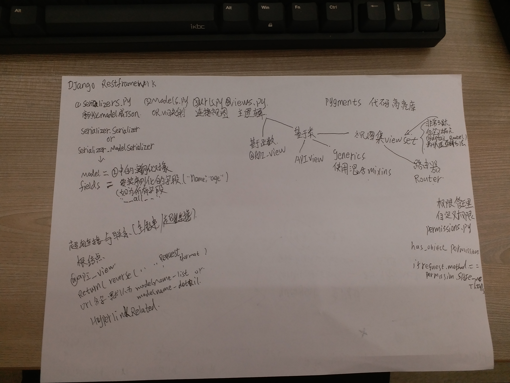

跟着Django rest framework 的官方文档敲了几遍，再理解一下，还是很简单的，能看出整体的框架，细节还需看源码

[官方文档](https://www.django-rest-framework.org/tutorial/1-serialization/)

  实例化serializer时many=True得到的是一个序列化查询集
 
 
  
`
  serializer = Serializer(snippet.objects.all(), many=True)
  `

