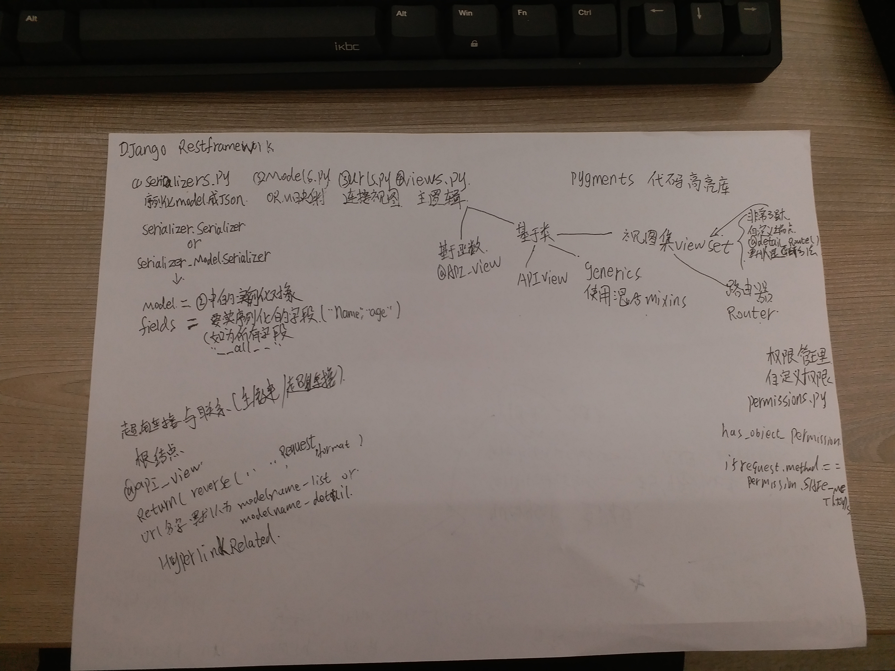


# 简介
markdown是一种纯文本标记语言，非常好用，用来记录笔记，或者学习知识，都是不错的选择，它最大的特点就是层次分明，支持各种编程语言，可以嵌入图片、超链接、代码块等等，我最初的目的是用来写GitHub上的readme.md文件的QAQ
# 1. 目录

    在开头写[toc]形成目录
    
# 2. 斜体和粗体

```
*我是斜体*
**我是粗体**
***我是加粗斜体***
~~我是删除线~~
```
显示效果：

*我是斜体*

**我是粗体**

***我是加粗斜体***

~~我是删除线~~

# 3. 分级标题

```
# 一级标题
## 二级标题
### 三级标题
...
```
# 4. 超链接{#a}

行内式：

[]里写链接文字，()里写链接地址, ()中的""中可以为链接指定title属性，title属性可加可不加。title属性的效果是鼠标悬停在链接上会出现指定的 title文字。[链接文字](链接地址 "链接标题")这样的形式。链接地址与链接标题前有一个空格。

```
欢迎来到[吴梦宇的GitHub](https://github.com/QaQwmy '吴梦宇的GitHub')
```
示例如下：

欢迎来到[吴梦宇的GitHub](https://github.com/QaQwmy '吴梦宇的GitHub')

参考式：

参考式链接分为两部分， [链接文字][链接标记]，在文本的任意位置添加[链接标记]:链接地址 "链接标题"，链接地址与链接标题前有一个空格。

如果链接文字本身可以做为链接标记，你也可以写成[链接文字][]
[链接文字]：链接地址的形式，见代码的最后一行。

  ```
  [简书][1],[github][2]
  [1]:http://www.jianshu.com "简书"
  [2]:http://www.github.com "GitHub"
  ```
  效果如下：（必须空一行）
  
  [简书][1],[github][2]
  
  [1]:http://www.jianshu.com "简书"
  [2]:http://www.github.com "GitHub"
  
  自动链接
  
  比较短的链接可以直接用尖括号括起来，达到超链接的目的
  
  ```
  <http://www.baidu.com>
  ```
  效果如下：
  
 <http://www.baidu.com> 
 
# 5. 锚点
 
网页中，锚点就是页面内超链接，语法是：
在你准备跳转到的地方做一个标记{#标记}，然后在文档的其他地方写上链接到锚点的链接

```
## 4. 超链接{#a}
跳转到[超链接](#a)
```
效果如下：

跳转到[超链接](#a)

# 6. 列表

无序列表

使用+、-、*表示无序列表
```
-无序列表1
-无序列表2
-无序列表3
```
效果如下：

- 无序列表1（和-号之间要有空格）

- 无序列表2

- 无序列表3

有序列表

使用数字+.来表示有序列表
```
1. 有序列表1
2. 有序列表2
3. 有序列表3
```
效果如下：

1. 有序列表1
2. 有序列表2
3. 有序列表3


# 7. 引用

```
> 引用1
>> 引用2
```
效果如下：

> 引用1
>> 引用2

# 8. 插入图片

```

```
效果如下：


插入本地图片



# 9. 注脚
```
使用 Markdown[^1]可以效率的书写文档, 直接转换成 HTML[^2], 你可以使用简书或者支持Markdown的编辑器进行书写。

[^1]:Markdown是一种纯文本标记语言

[^2]:HyperText Markup Language 超文本标记语言
```
效果如下：

使用 Markdown[^1]可以效率的书写文档, 直接转换成 HTML[^2], 你可以使用简书或者支持Markdown的编辑器进行书写。（脚注会在页面最下方显示）

[^1]:Markdown是一种纯文本标记语言

[^2]:HyperText Markup Language 超文本标记语言

# 10. 表格
```
|姓名|性别|
|-|-|
|张三|男|
|李四|女|
```
效果如下：

|姓名|性别|
|-|-|
|张三|男|
|李四|女|

# 11. 分割线

用三个以上的星号，并且同行内不能有其他任何东西
```
1
---
2
```
效果如下：

1
***
2

# 12. 代码块

用一对``来表示单行代码，用三个`来表示多行代码

效果如下：

`print "aaa"`

```
def add():
    print "aaa"
```


**************

暂且学到这儿！这是有道云链接
http://note.youdao.com/noteshare?id=7eef14eebbeefd25ab68c5e6100316f9&sub=FEF458CB9DF944E190D759FC888096A3
